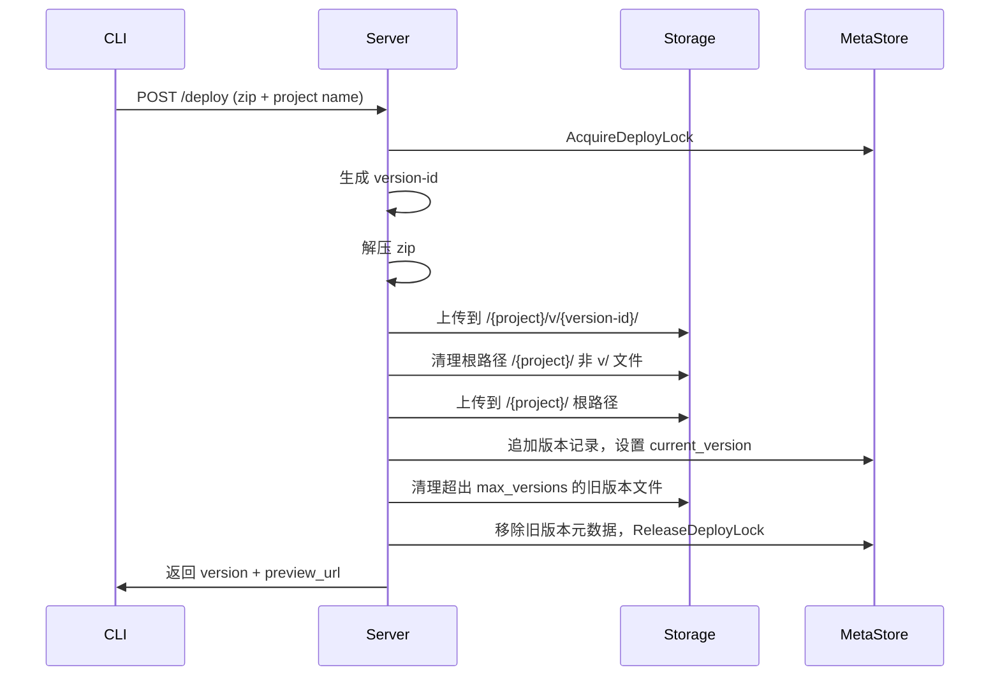
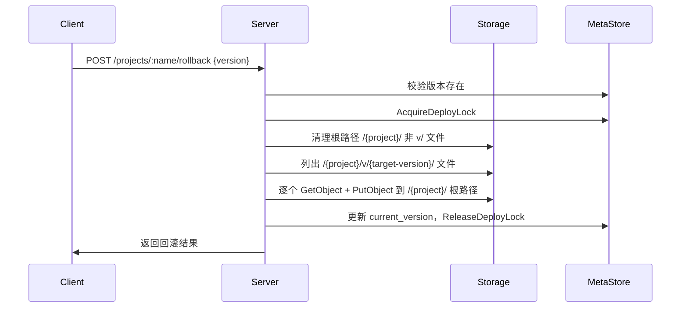

# 部署多版本管理设计

## 概述

为 oss-pages 添加部署版本管理能力，每次 deploy 保留历史版本快照，支持 preview URL 访问和回滚。

## 存储结构

```
{prefix}/{project}/index.html                     ← 当前生产版本（CDN 直接访问）
{prefix}/{project}/assets/app.js                   ← 当前生产版本
{prefix}/{project}/v/{version-id}/index.html       ← 版本快照
{prefix}/{project}/v/{version-id}/assets/app.js    ← 版本快照
```

- 每次 deploy 双写：版本目录 + 根路径
- CDN 直接访问根路径，无需代理层
- 历史版本通过 `/{project}/v/{version-id}/` 直接访问

### version-id 格式

`yyyyMMddHHmmss-shortUID`，例如 `20260412153000-a1b2c3`

- 时间戳便于排序和人类阅读
- 6 位短 UUID 防止同秒部署冲突

## 元数据结构

### 变更前

```json
{
  "name": "my-app",
  "url": "https://cdn.example.com/my-app/",
  "file_count": 12,
  "deployed_at": "2026-04-12T15:30:00Z",
  "deploying": false,
  "deploy_id": ""
}
```

### 变更后

```json
{
  "name": "my-app",
  "url": "https://cdn.example.com/my-app/",
  "current_version": "20260412153000-a1b2c3",
  "versions": [
    {
      "id": "20260412153000-a1b2c3",
      "deployed_at": "2026-04-12T15:30:00Z",
      "file_count": 12,
      "preview_url": "https://cdn.example.com/my-app/v/20260412153000-a1b2c3/"
    },
    {
      "id": "20260412140000-d4e5f6",
      "deployed_at": "2026-04-12T14:00:00Z",
      "file_count": 10,
      "preview_url": "https://cdn.example.com/my-app/v/20260412140000-d4e5f6/"
    }
  ],
  "deploying": false,
  "deploy_id": ""
}
```

- `versions` 按时间倒序排列，最新在前
- 移除顶层 `file_count` 和 `deployed_at`，改为从 `current_version` 对应的 version 条目获取
- `deploying` 和 `deploy_id` 保持不变，复用现有锁机制

## 配置变更

`config.yaml` 新增：

```yaml
max_versions: 10   # 每个项目保留的最大版本数，默认 10
```

## API 变更

### 现有端点修改

#### POST /deploy

响应新增字段：

```json
{
  "success": true,
  "project": "my-app",
  "url": "https://cdn.example.com/my-app/",
  "version": "20260412153000-a1b2c3",
  "preview_url": "https://cdn.example.com/my-app/v/20260412153000-a1b2c3/",
  "files": 12,
  "deployed_at": "2026-04-12T15:30:00Z"
}
```

#### GET /projects/:name

响应新增 `current_version` 和 `versions` 列表。

### 新增端点

#### POST /projects/:name/rollback

回滚到指定版本。

请求：

```json
{
  "version": "20260412140000-d4e5f6"
}
```

响应：

```json
{
  "success": true,
  "project": "my-app",
  "version": "20260412140000-d4e5f6",
  "rolled_back_at": "2026-04-12T16:00:00Z"
}
```

#### GET /projects/:name/versions

返回版本列表。

响应：

```json
{
  "versions": [
    {
      "id": "20260412153000-a1b2c3",
      "deployed_at": "2026-04-12T15:30:00Z",
      "file_count": 12,
      "preview_url": "https://cdn.example.com/my-app/v/20260412153000-a1b2c3/",
      "current": true
    }
  ]
}
```

#### DELETE /projects/:name/versions/:id

删除指定历史版本。不允许删除当前生产版本。

响应：

```json
{
  "success": true,
  "deleted_version": "20260412140000-d4e5f6"
}
```

## 核心流程

### 部署流程



### 回滚流程



### 版本清理流程

deploy 成功后自动执行：

1. 检查 `versions` 数量是否超过 `max_versions`
2. 超出的版本从最旧开始，删除 `/{project}/v/{old-version}/` 下所有文件
3. 从元数据中移除对应条目

### 删除项目

删除项目时清理所有版本目录和根路径文件。现有 `DeleteProject` 按前缀删除，路径结构变更后天然兼容。

## 影响范围

### 需要修改的文件

| 文件 | 变更内容 |
|------|----------|
| `storage/meta.go` | `ProjectMeta` 新增 `CurrentVersion`、`Versions` 字段；新增 `VersionMeta` 结构体；版本追加/清理逻辑 |
| `storage/s3.go` | `UploadProjectFiles` 支持版本前缀；新增 `CopyVersionToRoot`、`CleanRootFiles`、`DeleteVersion` 方法 |
| `deployer/deployer.go` | 生成 version-id；双写逻辑（版本目录 + 根路径） |
| `handler/deploy.go` | `DeployResponse` 新增 `Version`、`PreviewURL` 字段 |
| `handler/projects.go` | 新增回滚、版本列表、版本删除端点及 handler |
| `config/server.go` | 新增 `MaxVersions` 配置项 |
| `server/` | 注册新路由 |

### 不需要修改的文件

- CLI 端（`oss-cli deploy/push`）— 上传逻辑不变，服务端行为变化对 CLI 透明
- `s3client` 包 — 现有 API（PutObject, ListObjects, DeleteObjects, GetObject）足够
- `storage/file.go` — FileBackend 实现 S3API 接口，接口不变则无需修改

## 向后兼容

- 已部署的项目（无版本结构）在首次新版本部署时自动迁移：文件保持在根路径，元数据补充 `current_version` 和 `versions` 字段
- 无需一次性迁移脚本
